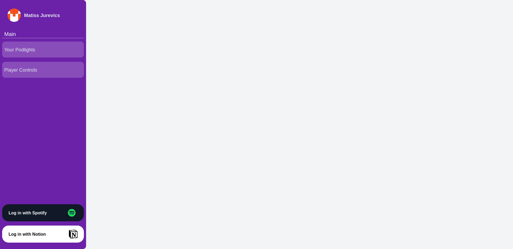

# (WIP) Spotify Podcast Highlights
Note: You can take a look at the app so far at: https://projects.podlights.saetom.xyz

## Roadmap
- [x] Create Responsive Sidebar
- [ ] Create search functionality for highlights
- [ ] Set up spotify api integration
- [ ] Set up notin api integration
- [ ] Create browser extention
- [ ] Create a homepage

## What is this? 
This application will use the spotify API to allow you to save timestamps of the podcasts your listening to to notion. This idea was formed from my personal need for an easy way to record certain parts of podcasts that I thought were interesting/informative.
